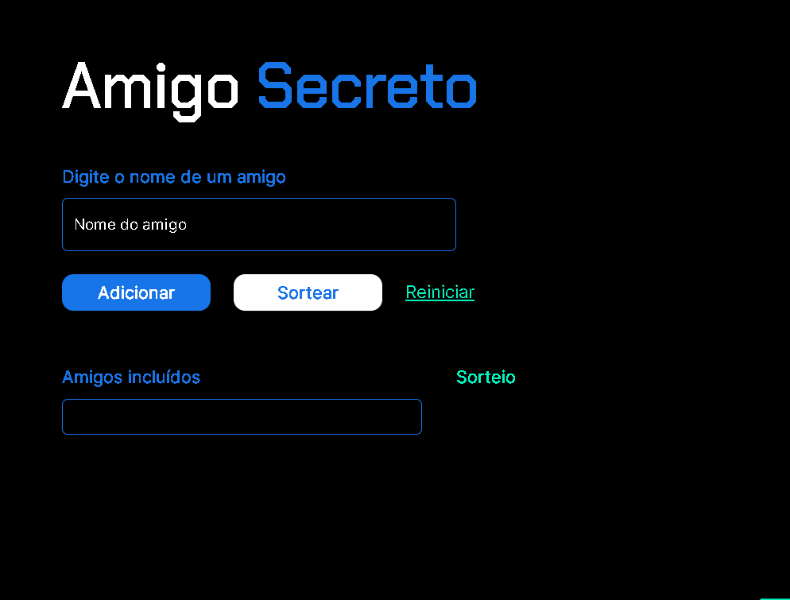
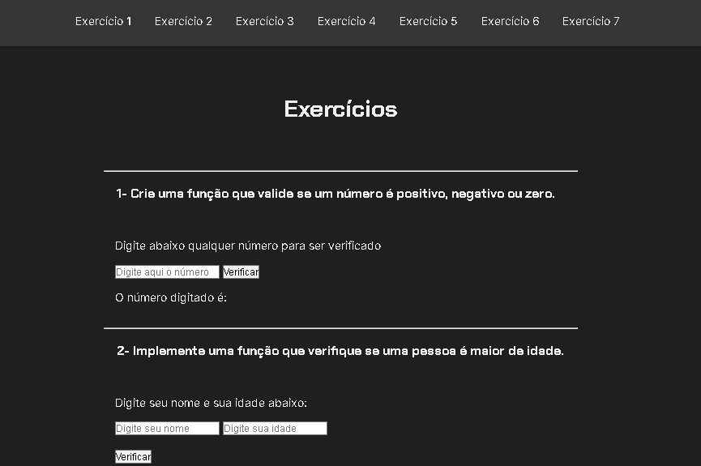

# Projeto Carrinho de compras

###



###

## Descrição do projeto
Desafio sorteio de amigo secreto para **reforçar os aprendizados em javascript**, fazendo um sistema de sorteio fictício criando as funções necessárias para faze-lo funcionar. O que foi reforçado nesse projeto:

- Recuperação de dados de input.
- Criação de listas.
- Adição de dados na lista.
- Mudança de texto dentro de uma tag para mostrar os itens da lista.
- Embaralhamento de lista para sorteio aleatório.
- Entre outras coisas.

###

# Área de exercícios



###

Área criada para alocar os exercícios que foram sugeridos pelos instrutores do curso, estilizada para **reforçar, também, recursos em HTML e CSS**.

###

## Linguagens utilizadas no projeto
<div>
  
  
  
</div>

###

## Como Executar

Para executar este projeto localmente, siga os passos abaixo:

1. **Clone o repositório:**
    
    ```bash
    git clone https://github.com/LeozinGs/javascript-amigo-secreto
    ```
    
2. **Navegue até o diretório do projeto.**
3. **Abra o arquivo `index.html` em seu navegador:**
    
    Basta dar um duplo clique no arquivo `index.html` ou abrir manualmente em seu navegador preferido.

4. **Área de exercícios**
    Basta dar um duplo clique no arquivo `exercicios.html` para acessar a area de teste de exercícios.